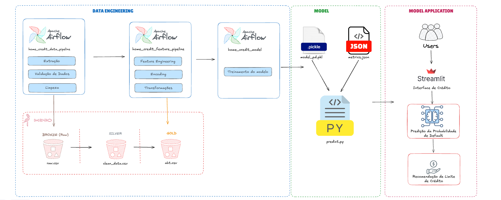

# Credit Risk MLOps
Projeto de ponta a ponta para predição de risco de crédito, utilizando técnicas de Machine Learning e práticas de MLOps para automação do pipeline e disponibilização do modelo em produção.

---

# 🏗️ Arquitetura do Projeto

A figura abaixo apresenta a arquitetura da solução desenvolvida para o pipeline de Machine Learning e MLOps, destacando o fluxo desde a ingestão dos dados até o treinamento e disponibilização do modelo.

<p>
  
</p>

---

# Monitoramento dos Dados

---

# 🚀 Como executar o projeto com Airflow

## 📋 Pré-requisitos

Antes de iniciar, certifique-se de possuir os seguintes requisitos instalados:

- 🐳 Docker Desktop

Além disso, é necessário possuir uma conta no **Kaggle**, utilizada para o download da base de dados do projeto.

---

## 🐳 1. Iniciar os serviços

1. Abra o **Docker Desktop**.
2. No terminal do repositório `credit-risk-mlops`, acesse o diretório:

```bash
MLOps/docker
```

3. Execute o comando abaixo para iniciar todos os containers:

```bash
docker compose up -d
```
> 💡 **Observação:** Na primeira execução, o processo pode levar alguns minutos, pois as imagens Docker serão baixadas e as dependências serão instaladas.

---

## 🌐 2. Acessar o Airflow

Após a inicialização dos containers, acesse a interface do Airflow:

```
http://localhost:8080
```

### 🔑 Credenciais de acesso

| Campo | Valor |
|--------|-------|
| **Usuário** | `admin` |
| **Senha** | `admin` |

---

## ⚙️ 3. Configurar as variáveis do Airflow

O projeto utiliza variáveis do Airflow para armazenar as credenciais de acesso ao Kaggle.

### 🔐 3.1 Gerar um Token da API do Kaggle

1. Acesse sua conta no **Kaggle**.
2. Clique em **Your API Token**.
3. Na seção **Legacy API Credentials**, clique em **Create Legacy API Key**.
4. Será realizado o download do arquivo `kaggle.json`.

Esse arquivo contém as seguintes informações de  `username` e  `key`.

---

### 📝 3.2 Atualizar o arquivo de variáveis

Abra o arquivo:

```
airflow_variables.json
```

Substitua os valores das variáveis abaixo pelas informações presentes no arquivo `kaggle.json`:

- `KAGGLE_USERNAME`
- `KAGGLE_KEY`

---

### 📥 3.3 Importar as variáveis no Airflow

Na interface do Airflow:

1. Acesse **Admin → Variables**.
2. Clique em **Import Variables**.
3. Selecione o arquivo `airflow_variables.json`.

> ✅ Após a importação, as DAGs estarão prontas para acessar o Kaggle durante a execução.

---

## ▶️ 4. Executar as DAGs

1. Acesse o menu **DAGs**.
2. Ative as três Dags que irão aparecer.
3. Clique em **Trigger DAG** da dag `home_credit_data_pipeline` para iniciar a execução.

📊 É possível acompanhar o andamento da execução pela própria interface do Airflow, acessando os logs de cada tarefa.

---

## ✅ Fluxo de execução

```text
🐳 Docker Compose
        │
        ▼
🌐 Airflow
        │
        ▼
🔐 Configuração das variáveis
        │
        ▼
📥 Download dos dados (Kaggle)
        │
        ▼
🧹 Limpeza dos dados
        │
        ▼
📊 Criação da ABT
        │
        ▼
🤖 Treinamento do modelo
        │
        ▼
📈 Predição de risco de crédito
```
   

